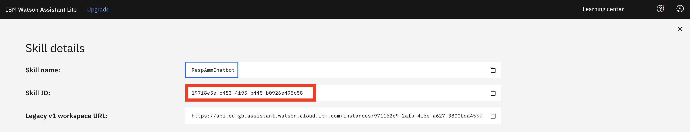

# LEGAL CHATBOT - Assistente virtuale a supporto delle figure professionali legali
Questo prototipo è un esempio funzionante di una WebApp che utilizza servizi Watson per la creazione un'assistente virtuale per professionisti in ambito legale.

Utilizzando la funzione Watson Discovery, miglioreremo il modello Discovery in modo che le query siano focalizzate per cercare solo le informazioni più rilevanti nei documenti inseriti.

Utilizzando Watson Assistant, utilizzeremo una finestra di dialogo standard per gestire una conversazione tra l'assistente virtuale e un professionista. Quando si effettua una richiesta, la finestra di dialogo dell'assistente comunicherà con il servizio Discovery tramite un webhook.

Il webhook verrà creato definendo una `web action` su IBM Cloud Functions.


## Cos'è Watson Discovery?

Watson Discovery permette di estrarre campi personalizzati (titolo,sottotitolo,testo, ecc)  nei documenti. Più si personalizza l'estrazione dei campi più i documenti vengono indicizzati e Discovery migliorerà le risposte restituite dalle query.

Annotare i campi all'interno dei tuoi documenti permette di addestrare modelli di conversione personalizzati. Mentre si annotano i campi, Watson impara dalle tue azioni e inizia a prevedere le annotazioni. I modelli possono anche essere esportati e utilizzati su altre collezioni.

Attualmente la piattaforma Watson per l'importazione di documenti prevede due piani:

  * Lite: PDF, Word, PowerPoint, Excel, JSON, HTML
  * Avanzato: PDF, Word, PowerPoint, Excel, PNG, TIFF, JPG, JSON, HTML

Ecco un video che fornisce una panoramica e una procedura dettagliata su come applicarlo al documento:
[](https://www.youtube.com/watch?v=Jpr3wVH3FVA)

## Cos'è un webhook?

Un webhook è un meccanismo che ti consente di chiamare un programma esterno in base a qualcosa che sta accadendo nel tuo programma. Se utilizzato in un dialogo Watson Assistant, un webhook viene attivato quando l'assistente elabora un nodo con un webhook abilitato. Il webhook raccoglie i dati durante la conversazione e li salva in variabili di contesto e invia i dati all'URL della richiesta del webhook come richiesta HTTP POST. L'URL che riceve il webhook è il listener. Esegue un'azione predefinita utilizzando le informazioni fornite dal webhook come specificato nella definizione del webhook e, facoltativamente, può restituire una risposta.

In questo prototipo, il webhook comunicherà con un `web action` di IBM Cloud Functions, che è connessa al servizio Watson Discovery.

> **Note**: Un altro metodo per integrare Watson Assistant con Watson Discovery è attraverso l'uso di una nuova funzionalità di Watson Assistant chiamata [search skill](https://cloud.ibm.com/docs/services/assistant?topic=assistant-skill-search-add).

## Architettura


1. L'utente interagisce con il server back-end tramite l'interfaccia utente dell'app. L'interfaccia utente dell'app è un chatbot che coinvolge l'utente in una conversazione.
1. Il dialogo tra l'utente e il server back-end è coordinato utilizzando Watson Assistant dialog skill.
1. Se l'utente pone una domanda, la query di ricerca viene passata a una action di IBM Cloud Functions.
1. La action Cloud Functions eseguirà una query sul servizio Watson Discovery e restituirà i risultati.


# Steps:

1. [Clona il repo](#1-clona-il-repo)
1. [Crea i servizi su IBM Cloud](#2-crea-i-servizi-su-ibm-cloud)
1. [Configura Watson Discovery](#3-configura-watson-discovery)
1. [Crea action IBM Cloud Functions](#4-crea-action-ibm-cloud-functions)
1. [Configura Watson Assistant](#5-configura-watson-assistant)
1. [Ottieni le credenziali dei servizi IBM Cloud e aggiungi al file env](#6-ottieni-le-credenziali-dei-servizi-ibm-cloud-e-aggiungi-al-file-env)
1. [Avvio dell'applicazione](#7-avvio-dell'applicazione)

### 1. Clona il repo

```bash
git clone https://github.com/Nello03/legal-chatbot.git
```

### 2. Crea i servizi IBM Cloud

Crea i seguenti servizi:

* [**Watson Discovery**](https://cloud.ibm.com/catalog/services/discovery)
* [**Watson Assistant**](https://cloud.ibm.com/catalog/services/assistant)

### 3. Configura Watson Discovery

Come mostrato di seguito, avvia lo strumento `Watson Discovery` e crea una nuova raccolta di dati selezionando l'opzione "Carica i tuoi dati". Assegna alla raccolta dati un nome univoco. Quando richiesto, seleziona e carica il file `SIntesiL241-1990.pdf` che si trova nella directory `data` del tuo repository locale.


Prima di applicare gli algoritmi di Discovery al nostro documento, eseguiamo alcune semplici query sui dati in modo da poterlo confrontare con i risultati rilevati dopo l'applicazione degli algoritmi.


Clicca `Build your own query` [1] bottone.


Immettere le query relative alla ricerca di articoli e visualizzare i risultati. Come vedrai, i risultati non sono molto utili e, in alcuni casi, nemmeno correlati alla domanda.

#### Annotazioni

Dal pannello Discovery, fare clic sul pulsante "Configura dati" (situato nell'angolo in alto a destra) per avviare il processo.

Ecco il layout della scheda `Identifica campi` del pannello delle annotazioni:


L'obiettivo è annotare tutte le pagine del documento in modo che Discovery possa apprendere quale testo è importante e quale testo può essere ignorato.

* [1] è l'elenco delle pagine del manuale. Man mano che ciascuno viene elaborato, sulla pagina verrà visualizzato un segno di spunta verde.
* [2] è la pagina corrente che viene annotata.
* [3] è dove selezioni il testo e gli assegni un'etichetta.
* [4] è l'elenco delle etichette che puoi assegnare al testo della pagina.
* Fare clic su [5] per inviare la pagina a Discovery.
* Fare clic su [6] dopo aver completato il processo di annotazione.

Mentre scorri le annotazioni una pagina alla volta, Discovery sta imparando e dovrebbe iniziare ad aggiornare automaticamente le pagine successive. Una volta raggiunta una pagina che è già annotata correttamente, è possibile interrompere o semplicemente fare clic su "Invia" [5] per confermare che è corretta. Più pagine annoti, migliore sarà il training del modello.

Per questo specifico documento, come minimo, si suggerisce di contrassegnare quanto segue:

* Il frontespizio principale come `title`.
* Tutte le intestazioni e i sottotitoli (digitati in verde chiaro) come `subtitle`.
* Tutti gli altri testi devono essere contrassegnati come `text`.

Dopo aver fatto clic sul pulsante `Apply changes to collection` [6], ti verrà chiesto di ricaricare il documento. Scegli lo stesso documento `.pdf` del manuale utente di prima.

Quindi, fai clic sulla scheda `Manage fields` [1].


* [2] Qui è dove dici a Discovery quali campi ignorare. Usando i pulsanti "on/off", disattiva tutte le etichette tranne `subtitles` e `text`.
* [3] sta dicendo a Discovery di dividere il documento a parte, in base a `subtitle`.
* Fare clic su [4] per inviare le modifiche.

Ancora una volta, ti verrà chiesto di ricaricare il documento.

Ora, come risultato della divisione del documento, la tua raccolta avrà un aspetto molto diverso:


Torna al pannello delle query (fai clic su `Build your own query`) e guarda quanto sono migliorati i risultati.


#### Archivia le credenziali per un uso futuro

Nei prossimi passaggi, dovrai fornire le credenziali per accedere alla tua collezione Discovery. I valori possono essere trovati nelle seguenti posizioni.

I valori `Collection ID` e `Environment ID` possono essere trovati facendo clic sul pulsante a discesa [1] situato nella parte in alto a destra del pannello della raccolta:


Per le credenziali, torna al pannello principale del tuo servizio Discovery e fai clic sulla scheda `Service credentials` [1]:


Fare clic sul menu a discesa `View credentials` [2] per visualizzare l'endpoint IAM `apikey` [3] e `URL` [4] per il proprio servizio.

### 4. Crea action IBM Cloud Functions

Ora creiamo la `web action` che eseguirà query sulla nostra raccolta Discovery.

Start the `IBM Cloud Functions` service by selecting `Create Resource` from the IBM Cloud dashboard. Enter `functions` as the filter [1], then select the `Functions` card [2]:

Avvia il servizio `IBM Cloud Functions` selezionando `Create Resource` dal dashboard IBM Cloud. Inserire `functions` come filtro [1], quindi selezionare la scheda `Functions` [2]:


Dal pannello principale `Functions`, fai clic sulla scheda `Actions`. Quindi fare clic su `Create`.

Dal pannello `Create`, seleziona l'opzione  `Create Action`.

Nel pannello `Create Action`, fornisci un `Action Name` univoco, mantieni il pacchetto predefinito e seleziona il runtime `Node.js 12`. Fare clic sul pulsante `Create` per creare l'azione.


Una volta creata la action, fai clic sulla scheda`Code`:


Nella finestra dell'editor, taglia e incolla il codice dal file `disco-action.js` che si trova nella directory `actions` del tuo repository locale. Il codice è piuttosto semplice: si connette semplicemente al servizio Discovery, esegue una query sulla raccolta, quindi restituisce la risposta.

Se premi il pulsante `Invoke`, fallirà a causa delle credenziali non ancora definite. Lo faremo dopo.

Seleziona la scheda `Parameters`:


Aggiungi le seguenti chiavi:

* url
* environment_id
* collection_id
* iam_apikey

Per i valori, utilizza i valori associati al servizio Discovery che hai creato nel passaggio precedente.

> Nota: assicurati di racchiudere i tuoi valori tra virgolette.

Ora che le credenziali sono impostate, torna al pannello `Code` e premi nuovamente il pulsante `Invoke`. Ora dovresti vedere i risultati effettivi restituiti dal servizio Discovery:


Quindi, vai al pannello `Endpoints`:


Fare clic sulla casella di controllo per `Enable as Web Action` [1]. Questo genererà un URL di endpoint pubblico [2].

Prendi nota del valore dell'URL [2], poiché sarà necessario per Watson Assistant in un passaggio futuro.

Per verificare di aver inserito i parametri Discovery corretti, eseguire il comando `curl` fornito [4]. Se fallisce, ricontrolla i valori dei parametri.

> **NOTE**: Quando copi il comando `curl`, assicurati di utilizzare l'icona `copy` elencata a destra del comando. Garantirà che la tua vera `API-KEY` venga sostituita. Puoi anche fare clic sull'icona `eye` per visualizzare il comando con il valore della chiave sostituito. A questo punto, puoi usare le normali azioni della tastiera per tagliare e incollare il comando nella finestra del tuo terminale.

Dopo aver chiuso la pagina del servizio IBM Functions, tieni presente che un servizio IBM Functions non verrà visualizzato nell'elenco delle risorse del dashboard. Per tornare al `Action` definita, sarà necessario accedere a IBM Functions selezionando `Create Resource` dal pannello principale del dashboard (come mostrato all'inizio di questo passaggio).

### 5. Configura Watson Assistant

Avvia il tuo servizio Watson Assistant e crea un nuovo assistente.


Una volta creato il tuo assistente, crea dialog skill facendo clic sul pulsante `Add dialog skill`. 


Nel pannello `Add dialog skill`, fai clic sull'opzione di menu `Use sample skill`.


Seleziona `Customer Care Sample Skill` come punto di partenza per la nostra nuova dialog skill. Questa dialog skill contiene tutti i nodi necessari per avere una tipica conversazione di call center con un utente.

#### Aggiungi nuovo intent

Di default una dialog non ha un modo per affrontare eventuali domande che coinvolgono risorse esterne, quindi dovremo aggiungerne.

Crea un nuovo `intent` in grado di rilevare quando l'utente chiede.

Dal pannello `Customer Care Sample Skill`, seleziona la scheda `Intents`.

Fare clic sul pulsante `Create intent`.

Assegna un nome all'intento `#Information` e, come minimo, inserisci le seguenti domande di esempio da associare ad esso.


#### Crea nuova dialog node (Esempio generico)

Ora dobbiamo aggiungere un nodo per gestire il nostro intent. Fare clic sulla scheda `Dialog`, quindi fare clic sul menu per il nodo in basso `anything_else` [1] e selezionare l'opzione `Add node above` [2].


Assegna un nome al nodo "Disco-ProcAmm" [1] e assegnalo al nostro nuovo intento [2].


Ciò significa che se Watson Assistant riconosce un input dell'utente come ad esempio "come faccio a impostare l'ora?", indirizzerà la conversazione a questo nodo.

#### Abilita webhook su Assistant

Configura l'accesso al nostro WebHook per l'action IBM Cloud Functions che hai creato nello Step #4.

Seleziona il tab `Options` -> `Webhooks`:


Inserisci l'endpoint URL pubblico per l'URL della action IBM Functions che hai creato nella sezione precedente.

> **Importante**: Aggiungi `.json` alla fine dell'URL per specificare che il risultato deve essere in formato JSON.

Torna alla scheda `Dialog` e fai clic sul un nodo. Dal pannello dei dettagli del nodo, fare clic sul pulsante "Personalizza", quindi abilita "Chiama un webhook" per questo nodo:


Clicca `Apply`.

Completare la configurazione del nodo come mostrato di seguito.


`[1]` Dovrai trasmettere la query dell'utente. Imposta `Key` su `input` e imposta il valore su `<?input.text?>`, che verrà compilato automaticamente dalla dialog skill.

`[2]` Il valore della `Return variable` è ciò che viene restituito dal webhook. Il valore `webhook_result_1` dovrebbe essere stato inserito automaticamente una volta abilitato il webhook per questo nodo.

`[3]` Questa è una conferma che il webhook è stato abilitato e impostato.

Il resto delle impostazioni viene utilizzato per elaborare i risultati.

`[4]` Se i risultati vengono restituiti dal webhook, riportali alla dialog skill.

`[5]` Se si verifica un errore, visualizza l'errore nella dialog skill.

`[6]` Se si verifica un timeout, visualizzare il messaggio "Riprova più tardi".

#### Fai un Test con il tool di Assistant 

Dal pannello `Dialog`, fai clic sul pulsante `Try it` situato nella parte in alto a destra del pannello.

Inserisci qualche input:


Si noti che l'ingresso "how do I turn on the heater?" ha attivato il nostro nodo di dialogo `Disco-ProcAmm`, indicato dalla risposta `#response`.

E poiché abbiamo specificato che `$webhook_result_1.passages` sia la risposta, viene visualizzato anche quel valore.

Puoi anche verificare che la chiamata sia stata completata con successo facendo clic sul pulsante `Manage Context` in alto a destra. La risposta dalla query Discovery verrà archiviata nella variabile `$webhook_result_1`:


### 6. Ottieni le credenziali dei servizi IBM Cloud e aggiungi al file env

Copia il file locale `env.sample` e rinominalo `.env`:

```bash
cp env.sample .env
```

Aggiorna il file `.env` con le credenziali del tuo servizio Assistant.

```bash
# Copy this file to .env and replace the credentials with
# your own before starting the app.

# Watson Assistant
ASSIATANT_URL=<add_assistant_url>
ASSISTANT_APIKEY=<add_assistant_apikey>
ASSISTANT_SKILL_ID=<add_assistant_skill_id>
ASSISTANT_ID=<add_assistant_id>

# Run locally on a non-default port (default is 3000)
# PORT=3000
```

Le credenziali possono essere trovate facendo clic sulla scheda Service Credentials, quindi sull'opzione View Credentials dal pannello del servizio Watson creato.


Per accedere al servizio Watson Assistant è necessario un valore aggiuntivo `ASSISTANT_SKILL_ID`. Per ottenere questo valore, seleziona la scheda `Skills` dal pannello principale di Watson Assistant. Dall'elenco delle skills create, seleziona quella che hai creato nel passaggio precedente (l'etichetta `LINKED ASSISTANTS` dovrebbe puntare all'assistente che hai creato). Fare clic sul menu delle action e selezionare l'opzione `View API Details`.


Fare clic sul pulsante di opzione (evidenziato nell'immagine sopra) per visualizzare la skill `API Details`. Qui troverai il valore `Skill ID`.



Per ottenere l' `ASSISTANT_ID` seleziona la scheda `Assistants` e andare sul settings di un assistant. 


Sulla scheda `API Details` si troverà `Assistant ID`


### 7. Avvio dell'applicazione

```bash
npm install
npm start
```

Accedi all'interfaccia utente facendo puntare il tuo browser su `localhost:3000/index`.

# Semplice Output


# Accesso ai risultati nell'applicazione

* Formato Json del risultato ottenuto da Discovery e ritornato dall'Assistant nell'oggetto contesto:

```json
  {
  "matching_results": 7,
  "passages": [
    {
      "document_id": "cbd350fb6009d84f68df31b66cc21e40_8",
      "end_offset": 47,
      "field": "subtitle",
      "passage_score": 8.020666103704764,
      "passage_text": "Art 6 COMPITI DEL RESPONSABILE DEL PROCEDIMENTO",
      "start_offset": 0
    },
    {
      "document_id": "cbd350fb6009d84f68df31b66cc21e40_16",
      "end_offset": 343,
      "field": "text",
      "passage_score": 4.697689362447593,
      "passage_text": "L’amministrazione deve subordinare la concessione di sovvenzioni, contributi, sussidi, ausili finanziari e l’attribuzione di vantaggi economici a persone ed enti pubblici e privati alla predeterminazione e pubblicazione dei criteri e modalità ai quali essa deve attenersi e la cui effettiva osservanza deve risultare dai singoli provvedimenti.",
      "start_offset": 0
    },
    {
      "document_id": "cbd350fb6009d84f68df31b66cc21e40_36",
      "end_offset": 2359,
      "field": "text",
      "passage_score": 4.697689362447593,
      "passage_text": "L’acquisizione di documenti amministrativi da parte di soggetti pubblici quando non rientra nelle previsioni del DPR 445/00 si deve rifare al principio di leale cooperazione istituzionale. Il diritto di accesso è esercitatile fino a quando la pubblica amministrazione ha l’obbligo di detenere i documenti amministrativi ai quali si chiede di accedere.",
      "start_offset": 2008
    }
  ],
  "results": [
    {
      "enriched_text": {
        "categories": [
          {
            "label": "/law, govt and politics",
            "score": 0.936287
          },
          {
            "label": "/family and parenting/adoption",
            "score": 0.898492
          },
          {
            "label": "/society/crime/property crime",
            "score": 0.806211
          }
        ],
        "concepts": [
          {
            "dbpedia_resource": "http://it.dbpedia.org/resource/Procedimento",
            "relevance": 0.957142,
            "text": "Procedimento"
          },
          {
            "dbpedia_resource": "http://it.dbpedia.org/resource/Provvedimento",
            "relevance": 0.953205,
            "text": "Provvedimento"
          },
          {
            "dbpedia_resource": "http://it.dbpedia.org/resource/Attività_istruttoria",
            "relevance": 0.923262,
            "text": "Attività istruttoria"
          },
          {
            "dbpedia_resource": "http://it.dbpedia.org/resource/Competenza",
            "relevance": 0.886656,
            "text": "Competenza"
          },
          {
            "dbpedia_resource": "http://it.dbpedia.org/resource/Giurisdizione",
            "relevance": 0.772093,
            "text": "Giurisdizione"
          }
        ],
        "entities": [],
        "sentiment": {
          "document": {
            "label": "neutral",
            "score": 0
          }
        }
      },
      "extracted_metadata": {
        "author": [
          "SerenaG"
        ],
        "file_type": "pdf",
        "filename": "SIntesiL241-1990.pdf",
        "sha1": "f8efd16f6759d5d696bb3168ea659bc87cc25a98"
      },
      "id": "cbd350fb6009d84f68df31b66cc21e40_8",
      "result_metadata": {
        "confidence": 0.2965379036094586,
        "score": 3.3175282
      },
      "segment_metadata": {
        "id": "36bda593-9867-42c2-aa93-b2a57923ac2f",
        "parent_id": "cbd350fb6009d84f68df31b66cc21e40",
        "total_segments": 45
      },
      "subtitle": [
        "Art 6 COMPITI DEL RESPONSABILE DEL PROCEDIMENTO"
      ],
      "text": "Il responsabile del procedimento:  Valuta, ai fini istruttori, le condizioni di ammissibilità, i requisiti di legittimazione, i presupposti rilevanti per emanare il provvedimento  Accerta d’ufficio i fatti, disponendo il compimento di tutti gli atti necessari e adotta tutte le misure per l’adeguato e sollecito svolgimento dell’istruttoria. Può chiedere rilascio di dichiarazioni e rettifiche di dichiarazioni o istanze erronee e incomplete, può esperire accertamenti tecnici, ispezioni, esibizioni di documenti.  Propone o indice, se ne ha la competenza, la Conferenza dei Servizi (art. 14)  Cura le comunicazioni, pubblicazioni e notificazioni  Adotta, se ne ha la competenza, il provvedimento finale o lo trasmette all’organo che è competente per l’adozione.  L’organo competente per l’adozione del provvedimento finale se diverso dal responsabile, non può discostarsi dalle risultanze dell’istruttoria del responsabile del procedimento a meno che non lo motivi nel provvedimento finale."
    },
    {
      "enriched_text": {
        "categories": [
          {
            "label": "/law, govt and politics",
            "score": 0.849206
          },
          {
            "label": "/society/crime/property crime",
            "score": 0.764275
          },
          {
            "label": "/law, govt and politics/government",
            "score": 0.66109
          }
        ],
        "concepts": [
          {
            "dbpedia_resource": "http://it.dbpedia.org/resource/Provvedimento",
            "relevance": 0.995617,
            "text": "Provvedimento"
          },
          {
            "dbpedia_resource": "http://it.dbpedia.org/resource/Procedimento",
            "relevance": 0.97481,
            "text": "Procedimento"
          },
          {
            "dbpedia_resource": "http://it.dbpedia.org/resource/Atto_normativo",
            "relevance": 0.766998,
            "text": "Atto normativo"
          }
        ],
        "entities": [],
        "sentiment": {
          "document": {
            "label": "neutral",
            "score": 0
          }
        }
      },
      "extracted_metadata": {
        "author": [
          "SerenaG"
        ],
        "file_type": "pdf",
        "filename": "SIntesiL241-1990.pdf",
        "sha1": "f8efd16f6759d5d696bb3168ea659bc87cc25a98"
      },
      "id": "cbd350fb6009d84f68df31b66cc21e40_10",
      "result_metadata": {
        "confidence": 0.23688146913636046,
        "score": 2.9219377
      },
      "segment_metadata": {
        "id": "83dbcafa-ff7d-4054-99e2-ea0a7b6107d2",
        "parent_id": "cbd350fb6009d84f68df31b66cc21e40",
        "total_segments": 45
      },
      "subtitle": [
        "Art 7 COMUNICAZIONE DI AVVIO DEL PROCEDIMENTO"
      ],
      "text": "Se non esistono esigenze di celerità, l’avvio del procedimento deve essere comunicato ai soggetti nei confronti dei quali tale provvedimento è destinato a produrre effetti diretti, a quelli che per legge devono essere informati e a coloro verso i quali il provvedimento può recare pregiudizio, se facilmente individuabili. L’Amministrazione può adottare, prima delle suddette comunicazioni, provvedimenti cautelari."
    },
    {
      "enriched_text": {
        "categories": [
          {
            "label": "/finance/grants, scholarships and financial aid",
            "score": 0.90168
          },
          {
            "label": "/finance/investing/funds",
            "score": 0.8428
          },
          {
            "label": "/finance/financial news",
            "score": 0.759369
          }
        ],
        "concepts": [
          {
            "dbpedia_resource": "http://it.dbpedia.org/resource/Ente_pubblico",
            "relevance": 0.756971,
            "text": "Ente pubblico"
          }
        ],
        "entities": [],
        "sentiment": {
          "document": {
            "label": "neutral",
            "score": 0
          }
        }
      },
      "extracted_metadata": {
        "author": [
          "SerenaG"
        ],
        "file_type": "pdf",
        "filename": "SIntesiL241-1990.pdf",
        "sha1": "f8efd16f6759d5d696bb3168ea659bc87cc25a98"
      },
      "id": "cbd350fb6009d84f68df31b66cc21e40_16",
      "result_metadata": {
        "confidence": 0.15453477717157568,
        "score": 2.3758848
      },
      "segment_metadata": {
        "id": "4bdd0b57-8790-47a6-b2c7-311adc17a8fa",
        "parent_id": "cbd350fb6009d84f68df31b66cc21e40",
        "total_segments": 45
      },
      "subtitle": [
        "Art 12 PROVVEDIMENTI ATTRIBUTIVI DI VANTAGGI ECONOMICI"
      ],
      "text": "L’amministrazione deve subordinare la concessione di sovvenzioni, contributi, sussidi, ausili finanziari e l’attribuzione di vantaggi economici a persone ed enti pubblici e privati alla predeterminazione e pubblicazione dei criteri e modalità ai quali essa deve attenersi e la cui effettiva osservanza deve risultare dai singoli provvedimenti."
    }
  ],
  "retrieval_details": {
    "document_retrieval_strategy": "untrained"
  },
  "session_token": "1_gXPAWP5ceM85DmZ3cut2rzRnsP"
}
```